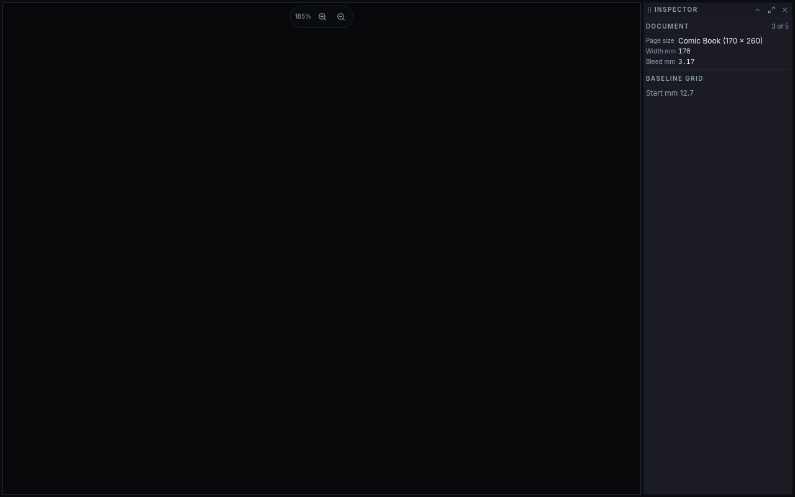
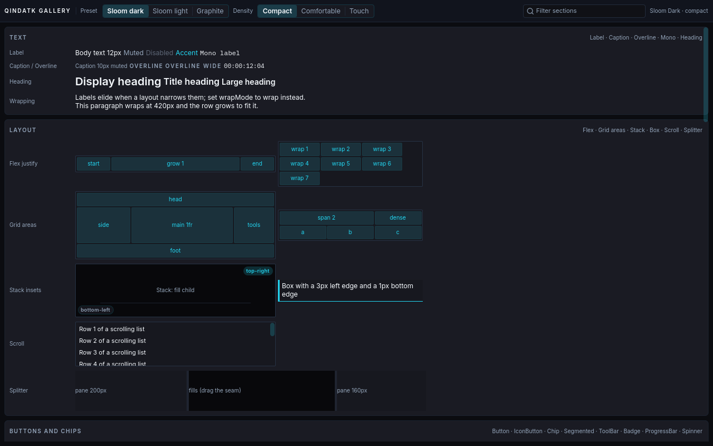
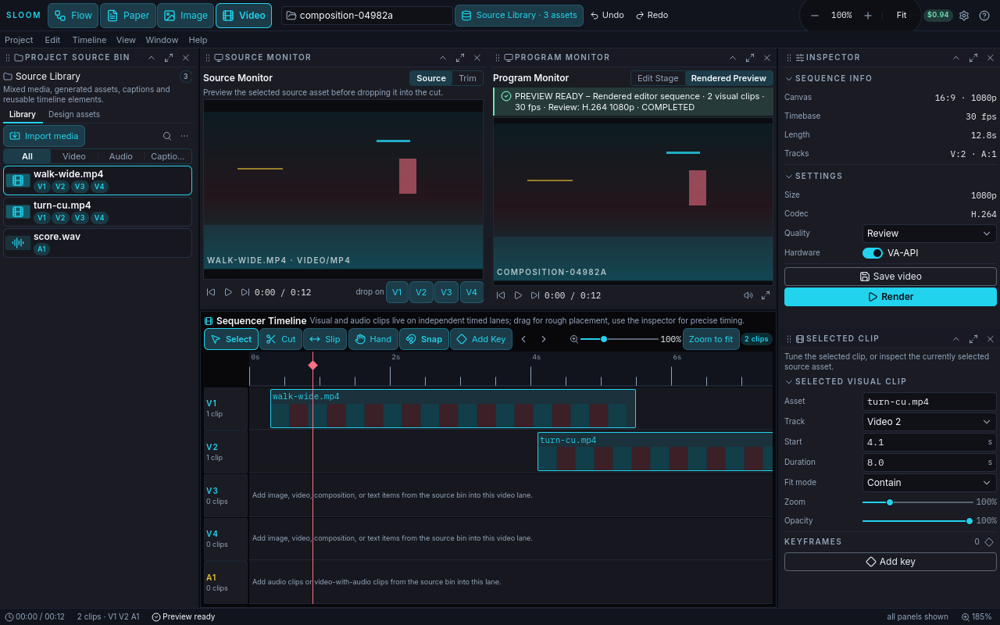
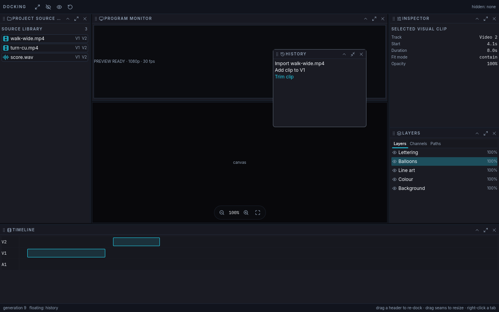
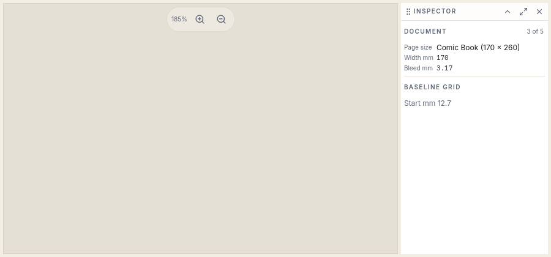
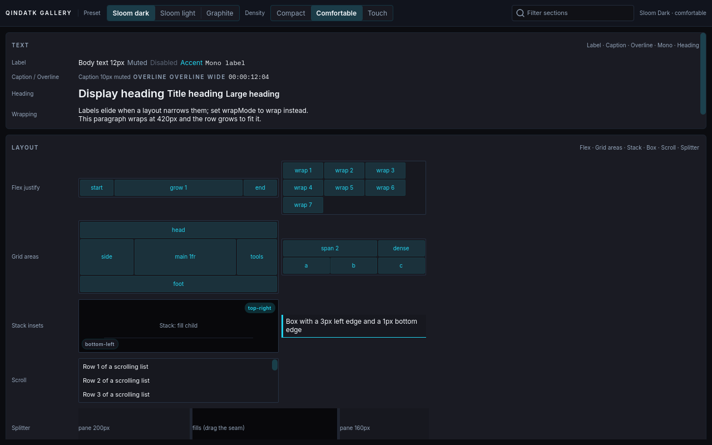
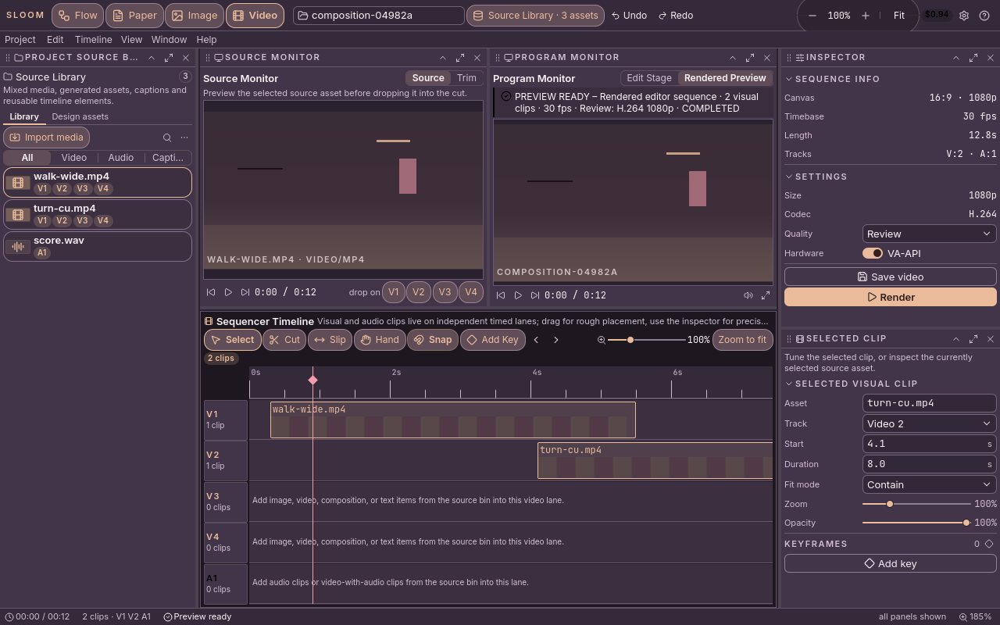
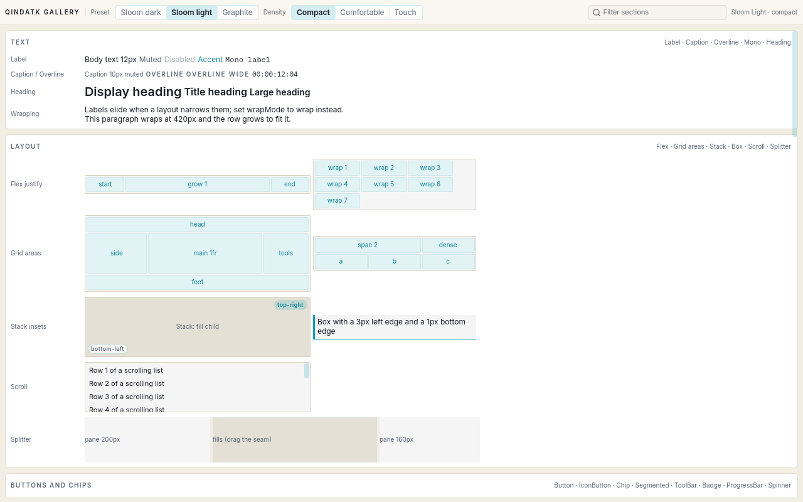

# QindaTK

**A Qt 6 / QML toolkit for dense, visually controlled desktop interfaces.**

QindaTK gives native QtQuick the layout control that CSS gives an Electron
app — flexbox, grid, absolute stacks, overflow scrolling, per-side borders,
dockable panels — without a browser in the process. It exists to build
[QindaStudio](../QindaStudio) (the native port of Sloom Studio) and any
other Qt 6 application on the QindaQt desktop that needs a 10–12px,
panel-dense, tool-heavy UI rather than a spacious one.

| Smoke example (inspector + canvas) | Gallery | Studio shell | Docking |
| --- | --- | --- | --- |
|  |  |  |  |
|  |  |  |  |

Screenshots are regenerated by `tools/scripts/screenshots.sh`.

## What is in the box

| Module | What it gives you |
| --- | --- |
| **Layout** (C++) | `Flex` (CSS flexbox: direction, wrap, justify, align, gap, grow/shrink/basis, order, min/max), `Grid` (CSS grid: `"200 1fr auto"`, `repeat()`, `minmax()`, areas, spans, auto-flow incl. dense), `Stack` (absolute positioning with insets), `Box` (padding, per-side borders, radius, single-child fill), `Scroll` (overflow auto/hidden per axis, overlay scrollbars). Implicit sizes flow bottom-up, so nested containers size like HTML. |
| **Theme** (C++) | `Theme` singleton: 53 colour roles derived from 12 base roles with the mix ratios measured from Sloom Studio, a 9–20px type ramp, spacing/radius/size/motion/opacity ladders, presets (`sloom-dark`, `sloom-light`, `graphite`), JSON theme files, colour math (`mix`, `alpha`, `onColor`). `Density` singleton: compact / comfortable / touch. |
| **Icons** (C++) | `Icon`: 300 Lucide icons as stroked vector paths, crisp at any size and DPI, tintable; custom SVG files; runtime registration. |
| **Document apps** (QML + C++) | `AppWindow` (menu bar, tool bars, content, find bar, status bar), `Viewport` (zoomable, scrollable page canvas with fit modes), `StylusHandler` (pen pressure, tilt, eraser end; the raw tablet event, which no QML handler otherwise sees), `MessageDialog` / `PromptDialog`, `ColorButton` / `ColorSwatches`, wrapping `ToolBar`, inline-rename `TreeRow`, radio `MenuItem`. See `examples/office-shell`. |
| **Controls** (QML) | Panel chrome, text family (`Label`, `Caption`, `Overline`, `Mono`, `Heading`), `Island`, `SectionHeader`, `Divider`, `Spacer`, `ToolTip`; buttons and chips (`Button`, `IconButton`, `Chip`, `Segmented`, `ToolBar`, `Badge`, `ProgressBar`, `Spinner`); inputs (`CheckBox`, `Switch`, `RadioButton`, `TextField`, `SearchField`, `TextArea`, `NumberField` with drag-to-scrub, `Slider`, `ComboBox`, `ColorField`); structure (`TabStrip`, `StatusBar`, `PropertyRow`, `PropertyGroup`, `KeyValue`, `ListRow`, `TreeRow`, `Menu`/`MenuBar`, `Popover`, `Dialog`, `CommandPalette`, `Notice`, `Splitter`, `Ruler`, `ZoomControl`, `EmptyState`, `Card`). The contract for each is [docs/controls.md](docs/controls.md); the generated [docs/catalog.json](docs/catalog.json) lists what the tree contains. |
| **Docking** (C++ model + QML host) | `DockModel`: zones (left/right/top/bottom/center/overlay), lanes, ordering, tab groups, floating panels, presets, named saved layouts, JSON persistence — API-compatible with QindaStudio's `PanelLayoutController`. The QML `DockHost` draws it and reports gestures. |
| **QindaQt bridge** (QML) | `QindaTK.QindaQt` feeds the desktop's QST-1 semantic tokens into `Theme`, so toolkit controls follow the desktop theme and accessibility settings. |
| **qtk-preview** (tool) | Renders any QML file headlessly: `--check`, `--dump` (item tree with geometry), `--grab` (PNG), `--dump-theme`, `--list-icons`; on a machine with the QindaQt desktop libraries also `--qst <theme>` / `--list-qst` to render under a real desktop theme. Built for agents and CI as much as for people. |

## Quick start

```cmake
find_package(QindaTK REQUIRED)            # after `cmake --install`
target_link_libraries(myapp PRIVATE QindaTK::qindatk)   # only if you use the C++ API
```

QML-only applications need nothing at link time: the module is installed
into Qt's QML import path.

```qml
import QtQuick
import QindaTK as Tk

Tk.Panel {
    title: "Inspector"
    width: 240; height: 320

    Tk.Scroll {
        Tk.Flex {
            direction: Tk.Flex.Column
            gap: Tk.Theme.space.sm

            Tk.SectionHeader { title: "Document"; count: "3 of 5" }
            Tk.Grid {
                columns: "auto 1fr"
                columnGap: Tk.Theme.space.sm
                rowGap: Tk.Theme.space.xs
                alignItems: Tk.Grid.Center
                Tk.Caption { text: "Width mm" }
                Tk.Mono { text: "170" }
                Tk.Caption { text: "Bleed mm" }
                Tk.Mono { text: "3.17" }
            }
        }
    }
}
```

Run it without writing an application:

```
build/dev/tools/preview/qtk-preview Inspector.qml            # on screen
build/dev/tools/preview/qtk-preview Inspector.qml --dump     # geometry, headless
```

## Build

Requirements: Qt 6.8+ (Core, Gui, Qml, Quick, QuickControls2, Svg,
QuickPrivate; Test and QuickTest for the test suite), CMake 3.25+, Ninja, a
C++20 compiler. Developed against Qt 6.11.1.

```
cmake --preset dev              # build/dev: Debug, tests, tools, examples
cmake --build --preset dev
ctest --preset dev              # headless (offscreen platform, software renderer)
```

Install (release preset):

```
cmake --preset release
cmake --build --preset release
cmake --install build/release   # DESTDIR=... for packaging
```

Installed layout: `libqindatk.so` in `${CMAKE_INSTALL_LIBDIR}`, headers in
`include/qindatk/`, CMake package in `lib/cmake/QindaTK/`, the QML modules
under Qt's import path (`QINDATK_QML_INSTALL_DIR`, default
`${QT6_INSTALL_PREFIX}/${QT6_INSTALL_QML}`, i.e. `/usr/lib64/qt6/qml` on
this machine) as `QindaTK/` and `QindaTK/QindaQt/`, and `qtk-preview` in
`bin/`.

From the build tree, import with `-I build/dev/qml` (or
`QML_IMPORT_PATH=build/dev/qml`); `qtk-preview` adds that path itself.

Gentoo: `packaging/gentoo/dev-libs/qindatk/` holds an ebuild and
`metadata.xml` for the `qindaqt` overlay (USE `examples` installs the QML
examples under `/usr/share/qindatk`, USE `test` runs the headless suite).

## The verification tool

`qtk-preview` is how a layout claim gets checked, on a headless machine or
by an agent that cannot see the screen:

```
qtk-preview file.qml --check                     # exit 0 iff it instantiates
qtk-preview file.qml --dump                      # Type#objectName x,y WxH "text"
qtk-preview file.qml --dump-json
qtk-preview file.qml --grab shot.png --size 1280x800
qtk-preview file.qml --theme sloom-light --density comfortable --grab shot.png
qtk-preview --dump-theme                         # resolved roles and ladders as JSON
qtk-preview --list-icons
```

Headless options switch to the `offscreen` platform and the software
renderer automatically; `--stay` keeps the window open afterwards.

When the QindaQt desktop libraries are installed (`QINDATK_PREVIEW_QINDAQT`,
on by default), two more options exercise the desktop bridge for real:

```
qtk-preview --list-qst                                # installed desktop theme ids
qtk-preview file.qml --qst qinda-dusk --grab out.png  # publish that theme through QindaQt.Tokens
```

The first line of output names the adopted theme.

## Following the QindaQt desktop theme

On the QindaQt desktop the `QindaQt.Tokens` singleton publishes QST-1
semantic tokens. Instantiate the bridge once in the application root and
`Theme` re-derives its roles from those tokens on every republish:

```qml
import QindaTK.QindaQt
QindaQtTheme { }
```

When the tokens are not ready, the toolkit keeps its current preset instead
of painting invented colours. Applications that do not run on the desktop
use a preset (`Tk.Theme.preset = "sloom-dark"`) or a JSON theme file
(`Tk.Theme.loadFile(path)`). See [docs/theming.md](docs/theming.md).

## Relationship to QindaStudio and Sloom Studio

Sloom Studio is the Electron original; QindaStudio is its native Qt port;
QindaTK is the toolkit extracted from what that port needs. The default
metrics are measurements of the running original, not preferences: panel
headers 24px, list rows 22px, controls 24px, chips 32px with a 6px radius,
island actions 36px fully rounded, 10px uppercase headers tracked 0.14–0.18em.
The colour roles are derived with the `color-mix` ratios of the original's
stylesheet and, for chips and islands, ratios recovered from its rendered
pixels. `DockModel` keeps the zone/lane/group vocabulary of the original's
`dockablePanel` contract and QindaStudio's `PanelLayoutController`, so the
studio can adopt it with a find-and-replace. The type-by-type map and the
migration order are in
[docs/qindastudio-migration.md](docs/qindastudio-migration.md).

## Documentation

- [docs/index.md](docs/index.md) — map of everything below
- [docs/architecture.md](docs/architecture.md) — modules, ownership, how apps link
- [docs/layout.md](docs/layout.md) — Flex / Grid / Stack / Box / Scroll reference
- [docs/theming.md](docs/theming.md) — roles, ladders, density, presets, JSON, the bridge
- [docs/controls.md](docs/controls.md) — the control catalog and API contract
- [docs/docking.md](docs/docking.md) — DockModel and DockHost
- [docs/qindastudio-migration.md](docs/qindastudio-migration.md) — moving QindaStudio onto QindaTK
- [docs/css-cheatsheet.md](docs/css-cheatsheet.md) — Tailwind/CSS idiom → QindaTK
- [docs/agent-playbook.md](docs/agent-playbook.md) — for coding agents
- [docs/decisions.md](docs/decisions.md), [docs/verification.md](docs/verification.md)
- [AGENTS.md](AGENTS.md) — the rules for working in this repository

## License

QindaTK is free software under the GNU Lesser General Public License,
version 3 or (at your option) any later version — `LGPL-3.0-or-later`
(see [LICENSE](LICENSE), [COPYING.LESSER](COPYING.LESSER), [COPYING](COPYING)).
The built-in icon shapes are from [Lucide](https://lucide.dev) (ISC); see
[THIRD_PARTY_NOTICES.md](THIRD_PARTY_NOTICES.md).
